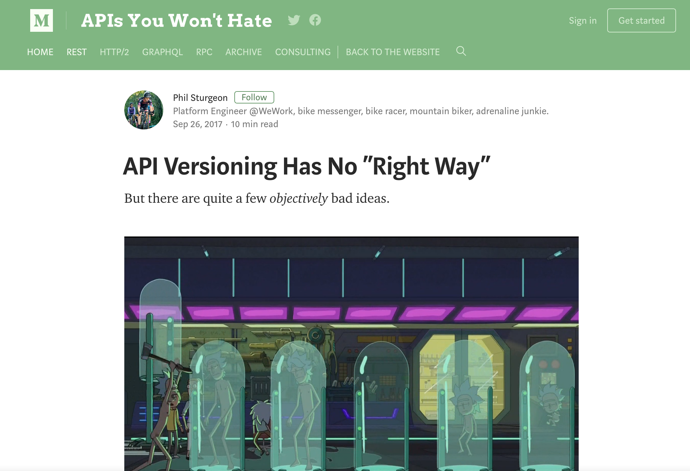

## A No Nonsense GraphQL, GRPC and REST Comparison

### @philsturgeon

---

> You have a few bikes right? Which is the best?

Note: Define better. They each aim at different things.

---

<!-- .slide: data-background="img/my-bikes-1.png" -->

Note: I am all for appropriate tool

---

<!-- .slide: data-background="img/my-bikes-2.png" -->

Note: I am all for appropriate tool

---

<!-- .slide: data-background="img/my-bikes-3.png" -->

Note: I am all for appropriate tool

---

<!-- .slide: data-background="img/my-bikes-4.png" -->

Note: I am all for appropriate tool

---

<!-- .slide: data-background="img/my-bikes-5.png" -->

Note: I am all for appropriate tool

---

<!-- .slide: data-background="img/random-bike-use-cases.jpg" data-background-size="contain" -->

Note: some aim to solve use cases you dont have

---

<!-- .slide: data-background="img/tall-bike.jpg" -->

Note: some unexpected

---

<!-- .slide: data-background="img/random-bike-hacks.png" data-background-size="contain" -->

Note: Some are hacks that legitimately work

---

## Pro-GraphQL
## Pro-REST
## Pro-RPC

Note: recommended RPC, REST _and_ GraphQL at WeWork

---

# "GraphQL is REST 2.0"

---

# "gRPC is REST 2.0"

---

<!-- .slide: data-background="img/nonsense.jpg" -->

---

## "Ok, well... GraphQL/gRPC is at least **better** for APIs"

---

<!-- .slide: data-background="img/nonsense.jpg" -->

---

## Mismarketing and Hype

People are excited about GraphQL and misrepresent it

---

## Mismarketing and Hype

People used to be excited about REST and misrepresent it

---

## Time Wasting

Rebuilding stuff to utilize an "out of the box" feature, which you cold have in your existing API, is **wasteful**

---

## Make Educated Decisions

Switching just because hype or cool is an expensive time sink

---

<!-- .slide: data-background="img/random-bikes-obviously-misused.jpg" data-background-size="contain" -->

Note: Doesn't matter what bike, misuse is no good

---

## GraphQL is new

Released by Facebook publicly in 2015

Note: GraphQL is a query language operating over RPC
specification
 collection of tools
 designed to operate over a single endpoint via HTTP

---

## GRPC is new too

Released by Google publicly also in 2015

Note: gRPC is a specific implementation of the RPC paradigm:

C, Java, Go, Node.js, Pythonm, Ruby

---

<!-- .slide: data-background="img/graphql-org.png" -->

---

## REST is older and nerdier

REST was a dissertation published by Roy Fielding in 2000

---

<!-- .slide: data-background="img/rest-disert.png" -->

Note: REST is an architectural concept for network-based software

Popularized (kinda) by companies like Twitter in 2006.

no official set of tools, specification

focus on making APIs last for decades

---

REST is a series of abstraction layers applied on top of RPC, that you may or may not need

---

<!-- .slide: data-background="img/richardson.png" data-background-size="contain" data-background-color="#fff" -->

---

<!-- .slide: data-background="img/richardson-not-rest.png" data-background-size="contain" data-background-color="#fff" -->

---

<!-- .slide: data-background="img/richardson-rest.png" data-background-size="contain" data-background-color="#fff" -->

---

Comparisons get tricky, as gRPC and GraphQL are _implementations_, and REST is an architectural concept

---

Think of REST like the concept of a "personal bike"

---

<!-- .slide: data-background="img/1890-bicycle-patent-minimal-blueprint-nikki-marie-smith.jpg" data-background-size="contain" data-background-color="#000" style="top: 0;display: block;" -->

---

## REST has no opinion on components

Note: Can change out components and it's still a bike, but there are a few concepts fundamental to it, designed to solve specific problems

---

You can swap out various components, and if it follows the concepts, it's still a REST API

---

## GraphQL is a fancy track racer built by "No 22"

---

<!-- .slide: data-background="img/fancy-track-bike.jpg" data-background-size="contain" data-background-color="#000" style="top: 0;display: block;" -->

---

Optimized for absolute speed, but ignored some concepts it decided it doesn't need

Like **brakes!**

---

<!-- .slide: data-background="img/velo.gif" data-background-size="contain" data-background-color="#000" style="top: 0;display: block;" -->

Note: Normally dont need brakes but

---


---

## GraphQL optimizes for network performance

Specifically tries to minimize "Content Download"

Trimming bits!

---

But ignores HTTP entirely, sucks on HTTP/2

---

## gRPC optimizes for network performance

Ignores a lot of HTTP, but leverages HTTP/2 multiplexing to minimize base speed

---

## REST optimizes for API longevity

Base speed of a single network interaction is a lesser concern

---

## REST optimizes for API longevity

Offers convention-based network & client level caching

---

## REST cares about decoupling client/server

---


Note: Losley coupled systems recover from crashes better

---

# Totally different goals

---

# Let's talk specifics

---

### False differentiations

---

<!-- .slide: data-background="img/rest-can-do-that-1.png" data-background-size="contain" data-background-color="#F5F6F8" -->

---

```
POST /graphql HTTP/1.1
Content-Type: application/graphql

{
  turtles(id: "123") {
    length,
    width,
    intelligence
  }
}
```

---

# REST Allows That

Sparse Fieldsets / Partials

```
GET /turtles/123?fields=length,width,intelligence HTTP/1.1
```

---

<!-- .slide: data-background="img/rest-can-do-that-2.png" data-background-size="contain" data-background-color="#F5F6F8" -->

---

# REST Allows That

JSON-based: JSON Schema / JSON-LD

Binary Based: Protobuf / BSON

---

<!-- .slide: data-background="img/rest-can-do-that-3.png" data-background-size="contain" data-background-color="#E6E8EC" -->

---

# REST Allows That

Compound Documents

JSON-API / OData

---

<!-- .slide: data-background="img/rest-can-do-that-4.gif" data-background-size="contain" data-background-color="#E6E8EC" -->

---

# REST Begs For That!

### API Evolution

---


---

[](https://blog.apisyouwonthate.com/api-versioning-has-no-right-way-f3c75457c0b7)

---

## So... GraphQL is a Query Language

Usually _but not exclusively_ operated over HTTP

---

## Nothing new about HTTP Query Languages

---

<!-- .slide: data-background="img/tenor.gif" data-background-size="contain" data-background-color="#000" -->

---

# FQL (2007)

```
GET /fql?q=SELECT status_id,message,time,source
FROM `status` WHERE uid = me()
```

🤢

---

## FQL Inspired GraphQL

Facebook disliked writing 2x code

1x for FQL  
1x for RESTish

Wanted one API that covered both uses

---

_Didn't need to invent a new API implementation to do that, but they did!_ 🙃

---

GraphQL = FQL + (REST - Hypermedia Controls)

Note: Most of us would never even consider using FQL

---

# SPARQL (2008)

```
#added before 2016-10
#Demonstrates "no value" handling
SELECT ?human ?humanLabel
WHERE
{
	?human wdt:P31 wd:Q5 .       #find humans
	?human rdf:type wdno:P40 .   #with at least one P40 (child) statement defined to be "no value"
	SERVICE wikibase:label { bd:serviceParam wikibase:language "[AUTO_LANGUAGE],en" }
}
```

[W3C Recommendation (2013)](https://www.w3.org/TR/sparql11-query/)

---

FIQL (2008)

```
title==foo*;(updated=lt=-P1D,title==*bar)
```

- have a title beginning with "foo", AND
- have been updated in the last day OR have a title ending with
 "bar".

[IETF Draft](https://tools.ietf.org/html/draft-nottingham-atompub-fiql-00)

---

Kinda weird that we _suddenly_ need a limited query language, but ignored all these options...

---

### RPC is older than time

```
POST /sayHello HTTP/1.1
HOST: api.example.com
Content-Type: application/json

{"name": "Racey McRacerson"}
```

---

```
/* Signature */
function sayHello(name) {
  // ...
}

/* Usage */
sayHello("Racey McRacerson");
```

---

## RPC and Query Languages suck at:

# Caching

---

## Client Caching

A GraphQL or gRPC client is entirely responsible for:

- Cache duration
- Cache invalidation

---

Each client has to guess the rules for how long to cache certain data, and how to invalidate

---

REST says this should be a concern of the server

---

Endpoint-based APIs can utilize all of HTTP Caching:

- `Expires`
- `Cache-Control`
- `ETag`
- `If-Modified-Since`
- `Varies`

---

## Network Caching

HTTP has loads of amazing caching proxies:

- Vanish
- Squid
- Fastly
- Nginx!

---


---

**Client A**

`GET /turtles?fields=name,lifespan`

200ms

---

**Client B**

`GET /turtles?fields=name`

192ms

---

%4 speedup by missing the cache to skip one field

---

**Client A**

`GET /turtles`

220ms

---

**Client B**

`GET /turtles`

118ms

---

10% slow down requesting all the things

_buuuut_

46% speedup by sharing that cache

---

Enable [faraday-http-cache](https://github.com/plataformatec/faraday-http-cache) to magically respect cache headers

---

## Compromise

Use [partials](https://blog.apisyouwonthate.com/a-happy-compromise-between-customization-and-cacheability-e48dc083ed10) as a middleground

```
GET /turtles?partial=dimensions
```

<small>is.gd/api_partials</small>

---

GrahQL/RPC cannot use existing HTTP network caching tools

---

Appolo are hacking in extension support for server caching in GraphQL

```
{
  "data": ...,
  "errors": ...,
  "extensions": {
    "cacheControl": {
      "version": 1,
      "hints: [
        {
          "path": [...],
          "maxAge": <seconds>,
          "scope": <PUBLIC or PRIVATE>
        },
        ...
```

🤣

---

## GraphQL sucks at:

Optimization, as potentially unlimited queries can exist

---

_You won't have an efficient GraphQL API without restructuring your data_

---

GitHub, Facebook, etc. have a few more resources than the rest of us

---

## JSON-API-style **mega-includes** in REST

GET /me?include=literally,everything,in,
the,goddam,database,what,is,
happening,so,slow,help,me,database,
server,is,on,fire,agggghhhhhh

---

## Multiple handshakes are not going to be _your_ bottleneck

_And HTTP/2 solves the multiple handshake issue anyway_

---

## REST vs RESTish

---

Most RESTish APIs miss the most important concept: Controls

---

<!-- .slide: data-background="img/hypermedia-like-no-handlebars.jpg" data-background-size="contain" data-background-color="#000"-->

---

<!-- .slide: data-background="img/richardson.png" data-background-size="contain" data-background-color="#fff" -->

---

Hypermedia controls are seen as confusing, slow or pointless

---

### BECAUSE THEY ARE MISUSED + MISUNDERSTOOD

---

## REST != CRUD over HTTP

---

Hypermedia "Links" are not just for related data

---

## REST == State Machines over HTTP

```ruby
class InvoiceStateMachine
  include Statesman::Machine

  state :draft, initial: true
  state :published
  state :sent
  state :paid

  transition from: :draft,        to: :published
  transition from: :published,    to: [:draft, :sent, :paid]
  transition from: :sent,         to: :paid

  # next slide
end
```

---

```ruby
  guard_transition(to: :sent) do |invoice|
    invoice.has_contact_info?
  end

  before_transition(to: :sent) do |invoice, transition|
    EmailService.new(invoice).send_contact_invoice
  end

  after_transition(to: :paid) do |invoice, transition|
    EmailService.new(invoice).send_owner_success
  end
```

---

## Simple State machines

``` ruby
invoice.current_state # => "draft"
invoice.allowed_transitions # => ["pay"]
invoice.transition_to(:paid) # => true/false
```

---

## State Machines can power Hypermedia Controls!

Original approach...

```
{
  "data": {
    "type": "invoice",
    "id": "093b941d",
    "attributes": {
      "bla": "stuff",
      "status": "draft"
    }
  },
  "links": {
    "pay": "https://api.acme.com/invoices/093b941d/payment_attempts"
  }
}
```

---

# Different levels of Hypermedia Controls

---

## 1.) String containing just URL

```
"links": {
  "pay": "https://api.acme.com/invoices/093b941d/payment_attempts"
}
```

- If link exists clients can "click it"
- (No guarentee of success)
- Make URL respond to `OPTIONS`
- Use `Allow: GET, PATCH` to show available actions

---

**Downsides**

1. Working out what GET and PATCH are exactly for
2. What fields should be sent to PATCH

---

## 2.) Add metadata to that OPTIONS payload

- Use JSON Schema to detail fields
- Use JSON HyperSchema to detail potential actions
- Entirely optional extra layer of strictness

---

**Downsides**

Optional nature means some clients will ignore/not notice

---

## 3.) Add Hypermedia controls in response

```
  "actions": [
    {
      "name": "add-item",
      "title": "Add Item",
      "method": "POST",
      "href": "http://api.x.io/orders/42/items",
      "type": "application/x-www-form-urlencoded",
      "fields": [
        { "name": "orderNumber", "type": "hidden", "value": "42" },
        { "name": "productCode", "type": "text" },
        { "name": "quantity", "type": "number" }
      ]
    }
  ],
```

[Siren](https://github.com/kevinswiber/siren) / [HAL](https://tools.ietf.org/html/draft-kelly-json-hal-06)

_[Many others](https://sookocheff.com/post/api/on-choosing-a-hypermedia-format/)_

---

**Downsides**

Increases size of response message

---

### Hypermedia Controls Pitch

Hypermedia Controls can help clients build "Actions" dropdowns dynamically!


---

### Hypermedia Controls Pitch

GraphQL cannot help you communicate with other systems

---

### Hypermedia Controls Pitch

Hypermedia can help you make cross-API requests

---

### Hypermedia Controls Pitch

iOS, Web and XBox apps _cannot_ mismatch state

Note: One client offers link another doesnt

---

**Client:** Hi, I would like to speak to Dr Watson, is he there?

**RPC:** No. \*click\*

\*Client calls back\*

**Client:** I checked his calendar, and it looks like he is off for the day. I would like to visit another doctor, and it looks like Dr Jones is available at 3pm, can I see her then?

**RPC:** Yes

---

**Client:** Hi, I would like to speak to Dr Watson, is he there?

**REST:** Doctor Watson is not currently in the office, he’ll be back tomorrow, but you have a few options. If it’s not urgent you could leave a message and I’ll get it to him tomorrow, or I can book you with another doctor, would you like to hear who is available today?

**Client:** Yes, please let me know who is there!

**REST:** Doctors Smith and Jones, here are links to their profiles.

---

**Client:** Ok, Doctor Jones looks like my sort of Doctor, I would like to see them, let’s make that appointment.

**REST:** Appointment created, here’s a link to the appointment details.

---

Is this API going to be used by mobile or web clients?

---

Does your API and all of its clients live in a monorepo?

---

Can deployments be coordinated between API and all its clients?

---

Will this APIs clients be similar to each other, or vary drastically? (i.e: Is it a BFF?)

---

Do you trust your clients to handle caching without any hints from the server?

---

Should the type system be required, or optional?

---

Is base speed the utmost importance, or longevity via evolution, hypermedia, etc?

---

## Which is more important?

Trimming bits from response

---

## Which is more important?

Firing off actions and getting async responses as fast as possible?

---

## Which is more important?

Letting potentially unknown clients work for a long time, with minimal changes?

---

Can you restructure all of your data in a way that unlimited possible queries will still be performant?

---

# Thanks!

Slides are up on [philsturgeon.uk/speaking](http://philsturgeon.uk/speaking)
