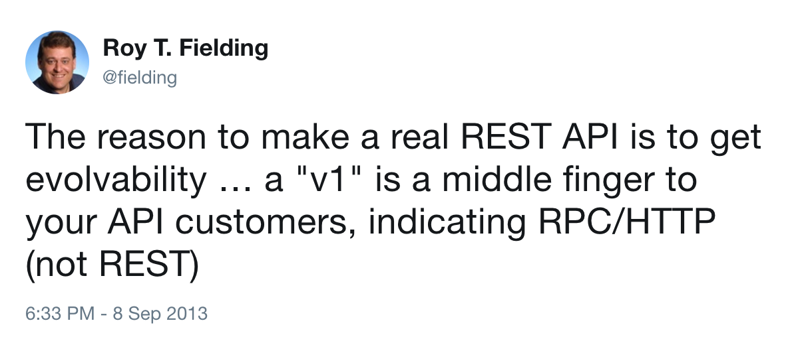
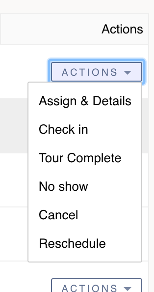

# A No Nonsense GraphQL and REST Comparison

### RubyConf Colombia 2017 / @philsturgeon

---

> You have a few bikes right? Which is the best?

Note: Define better. They each aim at different things.

---

<!-- .slide: data-background="img/many-bikes.jpg" data-background-size="contain" -->

Note: I am all for appropriate tool

---

<!-- .slide: data-background="img/random-bike-use-cases.jpg" data-background-size="contain" -->

Note: some aim to solve use cases you dont have

---

<!-- .slide: data-background="img/tall-bike.jpg" -->

Note: some unexpected

---

<!-- .slide: data-background="img/random-bike-hacks.png" data-background-size="contain" -->

Note: Some are hacks that legimately work

---

## Pro-GraphQL
## Pro-REST
## Pro-RPC

---

## Anti-Nonsense

Note: I have recommended RPC, REST _and_ GraphQL for different services at WeWork in the last few months.

---

# "GraphQL is REST 2.0"

---

<!-- .slide: data-background="img/nonsense.jpg" -->

---

## "Ok, well... GraphQL is at least better for APIs"

---

<!-- .slide: data-background="img/nonsense.jpg" -->

---

## Time Wasting

Rebuilding stuff to utilize an "out of the box" feature, which you cold have in REST, is wasteful

---

<!-- .slide: data-background="img/random-bikes-obviously-misused.jpg" data-background-size="contain" -->

Note: Doesnt matter what bike, misuse is no good

---

## Make Educated Decisions

Switching just because hype or cool is an expensive time sink

---

## GraphQL is newer

Released by Facebook publicly in 2015

Note: GraphQL is a query language operating over RPC
specification
 collection of tools
 designed to operate over a single endpoint via HTTP

---

<!-- .slide: data-background="img/graphql-org.png" -->

---

## REST is older and nerdier

REST was a dissertation published by Roy Fielding in 2000

---

<!-- .slide: data-background="img/rest-disert.png" -->

Note: REST is an architectural concept for network-based software

Popularized (kinda) by companies like Twitter in 2006.

no official set of tools, specification

focus on making APIs last for decades

---

REST as an architectural concept, is essentially the concept of a personal bike</small>

---

<!-- .slide: data-background="img/1890-bicycle-patent-minimal-blueprint-nikki-marie-smith.jpg" data-background-size="contain" data-background-color="#000" style="top: 0;display: block;" -->

---

## REST has no opinion on components

Note: Can change out components and it's still a bike, but there are a few concepts fundamental to it, and if you miss those you have a bad time

---

You can swap out various components, and if it follows the concepts, it's still a REST API

---

## GraphQL is a fancy track racer built by "No 22"

---

<!-- .slide: data-background="img/fancy-track-bike.jpg" data-background-size="contain" data-background-color="#000" style="top: 0;display: block;" -->

---

## A specific implementation, not a collection of concepts

---

Optimized for absolute speed, but ignored some concepts it decided it doesn't need

Like **brakes!**

---

<!-- .slide: data-background="img/velo.gif" data-background-size="contain" data-background-color="#000" style="top: 0;display: block;" -->

Note: Normally dont need brakes but

---


---

## GraphQL is optimized for network speed

But ignores HATEOAS and most of HTTP

---

## REST is optimized for API longevity

Network performance is a lesser concern

---

## REST cares about decoupling client/server

---


Note: Losley coupled systems recover from crashes better

---

# Totally different goals

---

# Let's talk specifics

---

### False differenciations

---

<!-- .slide: data-background="img/rest-can-do-that-1.png" data-background-size="contain" data-background-color="#F5F6F8" -->

---

```
POST /graphql HTTP/1.1
Content-Type: application/graphql

{
  turtles(id: "123") {
    length,
    width,
    intelligence
  }
}
```

---

# REST Allows That

Sparse Fieldsets / Partials

`GET /turtles/123?fields=length,width,intelligence`

---

<!-- .slide: data-background="img/rest-can-do-that-2.png" data-background-size="contain" data-background-color="#F5F6F8" -->

---

# REST Allows That

JSON-based: JSON Schema / JSON-LD

Binary Based: Protobuff / Cap'n Proto

---

<!-- .slide: data-background="img/rest-can-do-that-3.png" data-background-size="contain" data-background-color="#E6E8EC" -->

---

# REST Allows That

Compound Documents

JSON-API / OData

---

<!-- .slide: data-background="img/rest-can-do-that-4.gif" data-background-size="contain" data-background-color="#E6E8EC" -->

---

# REST Begs For That!

### API Evolution

---



---

## So... GraphQL is a Query Language

Ususally _but not exclusively_ operated over HTTP

---

## Nothing new about HTTP Query Languages

---

<!-- .slide: data-background="img/tenor.gif" data-background-size="contain" data-background-color="#000" -->

---

# FQL (2007)

```
GET /fql?q=SELECT status_id,message,time,source FROM `status` WHERE uid = me()

```

---

Facebook disliked writing 2x code

1x for FQL  
1x for RESTish

Wanted one API that covered both uses

---

GraphQL = FQL + (REST - Hypermedia)

Note: Most of us would never even consider using FQL

---

# SPARQL (2008)

```
#added before 2016-10
#Demonstrates "no value" handling
SELECT ?human ?humanLabel
WHERE
{
	?human wdt:P31 wd:Q5 .       #find humans
	?human rdf:type wdno:P40 .   #with at least one P40 (child) statement defined to be "no value"
	SERVICE wikibase:label { bd:serviceParam wikibase:language "[AUTO_LANGUAGE],en" }
}
```

[W3C Recommendation (2013)](https://www.w3.org/TR/sparql11-query/)

---

FIQL (2008)

```
title==foo*;(updated=lt=-P1D,title==*bar)
```

- have a title beginning with "foo", AND
- have been updated in the last day OR have a title ending with
 "bar".

[IETF Draft](https://tools.ietf.org/html/draft-nottingham-atompub-fiql-00)

---

## This Query Language approach sucks for...

# Caching

---

## Client Caching

A GraphQL Client is entirely responsible for:

- Cache duration
- Cache invalidation

---

Each client has to guess the rules for how long to cache certain data, and how to invalidate

---

REST says this should be a concern of the server

---

Endpoint-based APIs can utilize all of HTTP Caching:

- `Expires`
- `Cache-Control`
- `ETag`
- `If-Modified-Since`
- `Varies`

---

## Network Caching

HTTP has loads of amazing caching proxies:

- Vanish
- Squid
- Fastly
- Nginx!

---


---

**Client A**

`GET /turtles?fields=name,lifespan`

200ms

---

**Client B**

`GET /turtles?fields=name`

192ms

---

%4 speedup by missing the cache to skip one field

---

**Client A**

`GET /turtles`

220ms

---

**Client B**

`GET /turtles`

118ms

---

10% slow down requesting all the things

_buuuut_

46% speedup by sharing that cache

---

Enable [faraday-http-cache](https://github.com/plataformatec/faraday-http-cache) to magically respect cache headers

---

## Compromise

Use [partials](https://blog.apisyouwonthate.com/a-happy-compromise-between-customization-and-cacheability-e48dc083ed10) as a middleground

```
GET /turtles?partial=dimensions
```

<small>is.gd/api_partials</small>

---

GrahQL cannot use existing HTTP network caching tools

---

## Data has to be readily accessable for ANY query

That's not something you should take lightly

---

_You won't have an efficient customizable API without restructing your data_

---

## RESTish and GraphQL both suffer _MEGA INCLUDES_

JSON-API-style includes cause as much suffering:

GET /me?include=literally,everything,in,
the,goddam,database,what,is,
happening,so,slow,help,me,database,
server,is,on,fire,agggghhhhhh

---

## Multiple handshakes are not going to be _your_ bottleneck

_And HTTP/2 solves the multiple handshake issue anyway_

---

## REST vs RESTish

---

Most RESTish APIs miss the most important concept: Controls

---

<!-- .slide: data-background="img/hypermedia-like-no-handlebars.jpg" data-background-size="contain" data-background-color="#000"-->

---

<!-- .slide: data-background="img/richardson.png" data-background-size="contain" data-background-color="#fff" -->

---

<!-- .slide: data-background="img/richardson-not-rest.png" data-background-size="contain" data-background-color="#fff" -->

---

<!-- .slide: data-background="img/richardson-rest.png" data-background-size="contain" data-background-color="#fff" -->

---

Hypermedia controls are seen as confusing, slow or pointless

---

### BECAUSE THEY ARE MISUSED + MISUNDERSTOOD

---

## REST != CRUD over HTTP

---

Hypermedia "Links" are not just for related data

---

## REST == State Machines over HTTP

```ruby
class InvoiceStateMachine
  include Statesman::Machine

  state :draft, initial: true
  state :published
  state :sent
  state :paid

  transition from: :draft,        to: :published
  transition from: :published,    to: [:draft, :sent, :paid]
  transition from: :sent,         to: :paid

  # next slide
end
```

---

```ruby
  guard_transition(to: :sent) do |invoice|
    invoice.has_contact_info?
  end

  before_transition(to: :sent) do |invoice, transition|
    EmailService.new(invoice).send_contact_invoice
  end

  after_transition(to: :paid) do |invoice, transition|
    EmailService.new(invoice).send_owner_success
  end
```

---

## Simple State machines

``` ruby
invoice.current_state # => "draft"
invoice.allowed_transitions # => ["pay"]
invoice.transition_to(:paid) # => true/false
```

---

## State Machines can power Hypermedia Controls!

```
{
  "data": {
    "type": "invoice",
    "id": "093b941d",
    "attributes": {
      "bla": "stuff",
      "status": "draft"
    }
  },
  "links": {
    "pay": "https://api.acme.com/invoices/093b941d/payment_attempts"
  }
}
```

---

# Different levels of HATEOAS

---

## 1.) String containing a URL and that's it

```
"links": {
  "pay": "https://api.acme.com/invoices/093b941d/payment_attempts"
}
```

- Make that URL respond to `OPTIONS`
- List `Allow: GET, DELETE`

---

## 2.) Add metadata to that OPTIONS payload

- Use JSON Schema to detail fields
- Use JSON HyperSchema to detail potential actions

---

## 3.) Add Hypermedia controlls in response

```
  "actions": [
    {
      "name": "add-item",
      "title": "Add Item",
      "method": "POST",
      "href": "http://api.x.io/orders/42/items",
      "type": "application/x-www-form-urlencoded",
      "fields": [
        { "name": "orderNumber", "type": "hidden", "value": "42" },
        { "name": "productCode", "type": "text" },
        { "name": "quantity", "type": "number" }
      ]
    }
  ],
```

[Siren](https://github.com/kevinswiber/siren) / [HAL](https://tools.ietf.org/html/draft-kelly-json-hal-06)

_[Many others](https://sookocheff.com/post/api/on-choosing-a-hypermedia-format/)_

---

### HATEOAS Pitch

GraphQL cannot help you communicate with other systems

---

### HATEOAS Pitch

"Level 3" Hypermedia can help you submit to anything

---

### HATEOAS Pitch

HATEOAS can help clients build "Actions" dropdowns dynamically!



---

### HATEOAS Pitch

iOS, Web and Tablet will no longer mismatch state

Note: One client offers link another doesnt

---

## Enough, we dont want/need HATEOAS

---

GraphQL is a great alternative to JSON-API-like RESTish APIs

---

## GraphQL makes Deprecations awesome

```
POST /graphql HTTP/1.1
Content-Type: application/graphql

{
  turtles(id: "123") {
    length,
    width,
    intelligence
  }
}
```

---

```
type Turtle {
  length: String
  width: Int
  intelligence: String @deprecated
}

---

Endpoint-based APIs can deprecate whole endpoints

`Sunset: Thu, 13 Jul 2017 15:42:12 GMT`

([IETF Draft](https://tools.ietf.org/html/draft-wilde-sunset-header-03))

---

[faraday-sunset](https://github.com/philsturgeon/faraday-sunset)

---

> DEPRECATION WARNING: Endpoint #{env.url} is deprecated for removal on #{datetime.iso8601}

---

If you don't want to learn:

- Evolution instead of global versioning
- Serializing data
- Implement sparse fieldsets
- GZiping contents
- Outlining data structures with JSON Schema
- Offer binary alts to JSON like Protobuff or CapnProto

---

### The maybe just use GraphQL

---

It's packaged together in one system, which is cool

---

### Ask yourself

Are you ok letting go of HTTP?

---

### Ask yourself
How different are your clients from each other?

---

### Ask yourself
Do you trust your clients to handle caching without any hints from the server?

---

### Ask yourself
Do we _defitely_ never _ever_ want HATEOAS?

---

## I would use GraphQL for

A highly query-able API, with wide array of clients that need small and different data, and data is inexpensive to query...

---

## I would use GraphQL for

A [mostly] read-only Statistics API

---

## I would use GraphQL for

A CRUD API that 100% did not need HATEOAS or file uploads ever

---

## I would use GraphQL for

A CRUD API that the team might make shitty

---

# Thanks!

Slides are up on [philsturgeon.uk/speaking](http://philsturgeon.uk/speaking)

Go to [blog.apisyouwonthate.com](http://blog.apisyouwonthate.com) for more APIs
