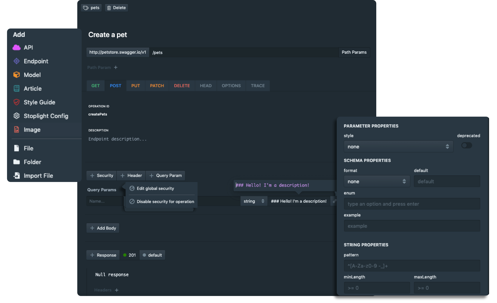

# A No Nonsense GraphQL and REST Comparison

### @philsturgeon

---

> You have a few bikes right? Which is the best?

Note: Define better. They each aim at different things.

---

<!-- .slide: data-background="img/my-bikes-1.png" -->

Note: I am all for appropriate tool

---

<!-- .slide: data-background="img/my-bikes-2.png" -->

Note: I am all for appropriate tool

---

<!-- .slide: data-background="img/my-bikes-3.png" -->

Note: I am all for appropriate tool

---

<!-- .slide: data-background="img/my-bikes-4.jpg" -->

Note: I am all for appropriate tool

---

<!-- .slide: data-background="img/my-bikes-5.png" -->

---

<!-- .slide: data-background="img/random-bike-use-cases.jpg" data-background-size="contain" -->

Note: some aim to solve use cases you dont have

---

<!-- .slide: data-background="img/tall-bike.jpg" -->

Note: some unexpected

---

<!-- .slide: data-background="img/random-bike-hacks.png" data-background-size="contain" -->

Note: Some are hacks that legitimately work

---

## Pro-GraphQL
## Pro-REST
## Pro-RPC

Note: recommended RPC, REST _and_ GraphQL at WeWork

---

# "GraphQL is REST 2.0"

---

<!-- .slide: data-background="img/nonsense.jpg" -->

---

## "Ok, well... GraphQL is at least better for APIs"

---

<!-- .slide: data-background="img/nonsense.jpg" -->

---

## Mismarketing and Hype

People are excited about GraphQL and misrepresent it

---

## Mismarketing and Hype

People used to be excited about REST and misrepresent it

---

## Time Wasting

Rebuilding stuff to utilize an "out of the box" feature, which you cold have in REST, is wasteful

---

## Make Educated Decisions

Switching just because hype or cool is an expensive time sink

---

<!-- .slide: data-background="img/random-bikes-obviously-misused.jpg" data-background-size="contain" -->

Note: Doesn't matter what bike, misuse is no good

---

## GraphQL is newer

Released by Facebook publicly in 2015

Note: GraphQL is a query language operating over RPC
specification
 collection of tools
 designed to operate over a single endpoint via HTTP

---

<!-- .slide: data-background="img/graphql-org.png" -->

---

## REST is older and nerdier

REST was a dissertation published by Roy Fielding in 2000

---

<!-- .slide: data-background="img/rest-disert.png" -->

Note: REST is an architectural concept for network-based software

Popularized (kinda) by companies like Twitter in 2006.

no official set of tools, specification

focus on making APIs last for decades

---

REST as an architectural concept, is essentially the concept of a personal bike</small>

---

<!-- .slide: data-background="img/1890-bicycle-patent-minimal-blueprint-nikki-marie-smith.jpg" data-background-size="contain" data-background-color="#000" style="top: 0;display: block;" -->

---

## REST has no opinion on components

Note: Can change out components and it's still a bike, but there are a few concepts fundamental to it, and if you miss those you have a bad time

---

You can swap out various components, and if it follows the concepts, it's still a REST API

---

## GraphQL is a fancy track racer built by "No 22"

---

<!-- .slide: data-background="img/fancy-track-bike.jpg" data-background-size="contain" data-background-color="#000" style="top: 0;display: block;" -->

---

## A specific implementation, not a collection of concepts

---

Optimized for absolute speed, but ignored some concepts it decided it doesn't need

Like **brakes!**

---

<!-- .slide: data-background="img/velo.gif" data-background-size="contain" data-background-color="#000" style="top: 0;display: block;" -->

Note: Normally dont need brakes but

---


---

## GraphQL is optimized for network speed

Make that big call smaller and therefore faster.

---

## REST is optimized for network efficiency

Reuse messages as much as reasonably possible.

---

## GraphQL avoids repetition through tight coupling

If you're a full-stack dev why repeat contracts on the frontend and the backend.

---

## REST bakes in more information to the message

Reduce the reliance on documentation by making each message self explanitory. Cache length, when to retry, can you even retry, etc.

---

# Totally different goals

---

# Let's talk specifics

---

### False differentiation

---

<!-- .slide: data-background="img/rest-can-do-that-1.png" data-background-size="contain" data-background-color="#F5F6F8" -->

---

```
POST /graphql HTTP/2
Content-Type: application/graphql

{
  turtles(id: "123") {
    length,
    width,
    intelligence
  }
}
```

---

# REST Has That

It's called "Sparse Fieldsets".

```
GET /turtles/123?fields=length,width,intelligence HTTP/2
```
```json
{
  "length": 11,
  "width": 6,
  "intelligence": 100
}
```

---

<!-- .slide: data-background="img/rest-can-do-that-2.png" data-background-size="contain" data-background-color="#F5F6F8" -->

---

# REST Has That

JSON Schema and OpenAPI.

```json
{
  "type": "object",
  "properties": {
    "name": {
      "type": "string",
      "maxLength": 20
    },
    "email": {
      "type": "string",
      "format": "email"
    },
    "date_of_birth": {
      "type": "string",
      "format": "date",
      "example": "1990–12–28"
    }
  }
}
```

---



---

<!-- .slide: data-background="img/rest-can-do-that-3.png" data-background-size="contain" data-background-color="#E6E8EC" -->

---

# REST Has That

It's called "Compound Documents"

Available in JSON-API, OData, HAL, Siren, etc.

---

<!-- .slide: data-background="img/rest-can-do-that-4.gif" data-background-size="contain" data-background-color="#E6E8EC" -->

---

# REST Begs For That!

### API Evolution

---


---

## GraphQL makes deprecation easy

```
POST /graphql HTTP/2
Content-Type: application/graphql

{
  turtles(id: "123") {
    length,
    width,
    intelligence
  }
}
```

---

```
type Turtle {
  length: Int
  width: Int
  intelligence: String @deprecated
}
```

---

Endpoint-based APIs can deprecate whole endpoints.

```js
fastify.get('/old', options, (request, reply) => {
  reply
    .code(200)
    .header('Content-Type', 'application/json')
    .header('Deprecation', 'true')
    .header('Sunset', 'Thu, 31 Dec 2020 23:59:59')
    .send({ hello: 'world' });
});
```

---

> DEPRECATION: Endpoint #{env.url} is deprecated for removal on #{datetime.iso8601}

---

They can both do all the same general stuff. 

So... wtf?

---

## GraphQL is _kinda_ a Query Language

Usually _but not exclusively_ operated over HTTP.

---

## Nothing new about HTTP Query Languages

---

<!-- .slide: data-background="img/tenor.gif" data-background-size="contain" data-background-color="#000" -->

---

# FQL (2007)

```
GET /fql?q=SELECT status_id,message,time,source FROM `status` WHERE uid = me()

```

---

Facebook disliked writing 2x code.

- 1x for FQL  
- 1x for RESTish

Wanted one API that covered both uses.

---

GraphQL = FQL + (REST - Hypermedia)

Note: Most of us would never even consider using FQL

---

# SPARQL (2008)

```
#added before 2016-10
#Demonstrates "no value" handling
SELECT ?human ?humanLabel
WHERE
{
	?human wdt:P31 wd:Q5 .       #find humans
	?human rdf:type wdno:P40 .   #with at least one P40 (child) statement defined to be "no value"
	SERVICE wikibase:label { bd:serviceParam wikibase:language "[AUTO_LANGUAGE],en" }
}
```

[W3C Recommendation (2013)](https://www.w3.org/TR/sparql11-query/)

---

FIQL (2008)

```
title==foo*;(updated=lt=-P1D,title==*bar)
```

- have a title beginning with "foo", AND
- have been updated in the last day OR have a title ending with
 "bar".

[IETF Draft](https://tools.ietf.org/html/draft-nottingham-atompub-fiql-00)

---

## This Query Language approach sucks for...

# Caching

---

## Client Caching

A GraphQL Client is entirely responsible for:

- Cache duration
- Cache invalidation

---

Each client has to guess the rules for how long to cache certain data, and how to invalidate.

```ruby
Rails.cache.fetch("users/#{uuid}", expires_in: 12.hours.from_now) do
  UserAPI.find_user(uuid)
end
```

12 is arbitrary!

---

"My email is showing up differently in two different places..."

---

REST says this should be a concern of the server.

```
Cache-Control: public, max-age=1800
```

---

You might want to increase cache duration when stability wobbles, decrease when its good.

```
Cache-Control: public, max-age=6000
Cache-Control: public, max-age=60
```

---

Endpoint-based APIs can utilize all of HTTP Caching:

- `Expires`
- `Cache-Control`
- `ETag`
- `If-Modified-Since`
- `Varies`

---

## Network Caching

HTTP has loads of amazing caching proxies:

- Vanish
- Squid
- Fastly
- Nginx!

They're all ready to go and don't need to know anything about your API.

---


---

**Client A**

`GET /turtles?fields=name,lifespan`

200ms

---

**Client B**

`GET /turtles?fields=name`

192ms

---

%4 speedup by missing the cache to skip one field

---

**Client A**

`GET /turtles`

220ms

---

**Client B**

`GET /turtles`

118ms

---

10% slow down requesting all the things

_buuuut_

46% speedup by sharing that cache

---

Enable [faraday-http-cache](https://github.com/plataformatec/faraday-http-cache) to magically respect cache headers

---

## Compromise

Use [partials](https://blog.apisyouwonthate.com/a-happy-compromise-between-customization-and-cacheability-e48dc083ed10) as a middleground

```
GET /turtles?partial=dimensions
```

<small>is.gd/api_partials</small>

---

GrahQL cannot use existing HTTP network caching tools

---

## Data has to be readily accessible for ANY query

That's not something you should take lightly

---

_You won't have an efficient GraphQL API without restructuring your data_

---

GitHub, Facebook, etc. have a few more resources than the rest of us

---

## JSON-API-style **mega-includes** same

GET /me?include=literally,everything,in,
the,goddam,database,what,is,
happening,so,slow,help,me,database,
server,is,on,fire,agggghhhhhh

---

## Bizarre Fear of "Multiple handshakes"

1999: HTTP/1.1 "keep-alive" solved multiple handshakes
2015: HTTP/2.0 reuses same connection
2021: HTTP/3.0 improves performance again

---

## Confusion about multiple Methods

- POST
- PUT
- PATCH
- DELETE

---

But when everything is "query" or "mutation", how do you tell the difference between a partial update and a complete replace?

Everyone has to invent this convention. 

- updateFoo?
- updatePartialFoo?
- updateFooFull?

--- 

Caching tools haven't got a clue about your convention.

HTTP clients don't know if they can retry those mutations.

---
## REST vs RESTish

---

Most RESTish APIs miss the most important concept: Controls

---

<!-- .slide: data-background="img/hypermedia-like-no-handlebars.jpg" data-background-size="contain" data-background-color="#000"-->

---

<!-- .slide: data-background="img/richardson.png" data-background-size="contain" data-background-color="#fff" -->

---

<!-- .slide: data-background="img/richardson-not-rest.png" data-background-size="contain" data-background-color="#fff" -->

---

<!-- .slide: data-background="img/richardson-rest.png" data-background-size="contain" data-background-color="#fff" -->

---

Hypermedia controls are seen as confusing, slow or pointless, but they normalize state instead of leaking state all over client code.

---

## REST != CRUD over HTTP

---

## REST == State Machines over HTTP

```ruby
class InvoiceStateMachine
  include Statesman::Machine

  state :draft, initial: true
  state :published
  state :sent
  state :paid

  transition from: :draft,        to: :published
  transition from: :published,    to: [:draft, :sent, :paid]
  transition from: :sent,         to: :paid

  # next slide
end
```

---

```ruby
  guard_transition(to: :sent) do |invoice|
    invoice.has_contact_info?
  end

  before_transition(to: :sent) do |invoice, transition|
    EmailService.new(invoice).send_contact_invoice
  end

  after_transition(to: :paid) do |invoice, transition|
    EmailService.new(invoice).send_owner_success
  end
```

---

## Simple State Machines

``` ruby
invoice.current_state # => "draft"
invoice.allowed_transitions # => ["pay"]
invoice.transition_to(:paid) # => true/false
```

---

## State Machines can power Hypermedia Controls

If you see a pay link, you can make a payment.

```
{
  "data": {
    "id": "093b941d",
    "bla": "stuff",
    "status": "draft"
  },
  "links": {
    "pay": "https://api.acme.com/invoices/093b941d/payment_attempts"
  }
}
```

---

Compare this to the GraphQL or RESTish "just a bunch of data" approach.

```
{
  "data": {
    "id": "093b941d",
    "published_at": "2017-06-15 12:31:01Z",
    "sent_at": "2017-06-15 12:34:29Z",
    "paid_at": null
  }
}
```

---

```
{
  "data": {
    "id": "093b941d",
    "published_at": "2017-06-15 12:31:01Z",
    "sent_at": "2017-06-15 12:34:29Z",
    "paid_at": "2017-06-16 09:05:00Z",
    "payment_received_at": null
  }
}
```

---

```
{
  "data": {
    "id": "093b941d",
    "published_at": "2017-06-15 12:31:01Z",
    "sent_at": "2017-06-15 12:34:29Z",
    "paid_at": null,
    "payment_received_at": null,
    "status": "payable"
  }
}
```

---

```
{
  "data": {
    "id": "093b941d",
    "published_at": "2017-06-15 12:31:01Z",
    "sent_at": "2017-06-15 12:34:29Z",
    "paid_at": null,
    "payment_received_at": null,
    "status": "payable"
  },
  "links": {
    "pay": "https://api.acme.com/invoices/093b941d/payment_attempts"
  }
}
```

---

## Hypermedia Controls with JSON:API

```
{
  // ...
  "links": {
    "pay": {
      "href": "https://api.acme.com/invoices/093b941d/payment_attempts"
      "describedby": "http://example.com/schemas/payment_attempt"
    }
  }
}
```

JSON Schema to the rescue! 

---

## Hypermedia Controls with Siren

```
  "actions": [
    {
      "name": "add-item",
      "title": "Add Item",
      "method": "POST",
      "href": "http://api.x.io/orders/42/items",
      "type": "application/x-www-form-urlencoded",
      "fields": [
        { "name": "orderNumber", "type": "hidden", "value": "42" },
        { "name": "productCode", "type": "text" },
        { "name": "quantity", "type": "number" }
      ]
    }
  ],
```

[Siren](https://github.com/kevinswiber/siren) makes it _really_ easy.

_[Many other hypermedia formats to try out.](https://sookocheff.com/post/api/on-choosing-a-hypermedia-format/)_

---

HATEOAS can help clients build "Actions" dropdowns dynamically!


---

Looks gross? Doesn't matter. Grab a sweet sweet client like ketting.

```js
const newRes = await res
  .follow('article-collection')
  .followAll('item')
  .preFetch();
```

--- 

**Pros**

- State moved from frontend to the server
- Multiple clients less likely to diverge
- Less conversations required about what fields infer what state

**Cons**

- Increases size of response message
- Change in mindset for client developers
- Annoying if you're building front and back simultaneously

---

Hypermedia Controls can be really useful. Don't always need them.

---

GraphQL is a great alternative to JSON-API-like RESTish APIs.

---

If you don't want to learn:

- HTTP/2 clients
- Serializing data
- Implementing sparse fieldsets
- GZiping contents
- Schemas/Types with JSON Schema
- HTTP Caching
- Offer binary alts to JSON like Protobuf
- ... 


---

### The maybe just use GraphQL

---

It's packaged together in one system, which is cool.

---

### Ask yourself

Are you ok letting go of HTTP conventions?

---

### Ask yourself

Do we need sparse fieldsets or could we design our API better?

---

### Ask yourself

Do you trust your clients to handle caching without any hints from the server?

---

### Ask yourself

Do we _definitely_ never _ever_ want HATEOAS?

---

## I would use GraphQL for

A highly query-able API, with wide array of clients that need small and different data, and data is inexpensive to query...

---

## I would use GraphQL for

A [mostly] read-only Statistics API

---

## I would use GraphQL for

A CRUD API that 100% did not need HATEOAS or file uploads ever.

---

It's not about which is best. Generally you want a mixture.

---

<!-- .slide: data-background="img/context-boundary.png" -->

---

"Picking the Right Paradigm"

`apisyouwonthate.com/blog`

---

Books and blogs on [apisyouwonthate.com](https://apisyouwonthate.com)

---

# Thanks!

Slides are up on [phil.tech/talks](http://phil.tech/talks)
