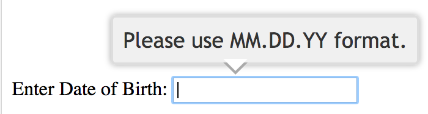

## Getting Specific About APIs

### Label your hecking units

CapitalOne DevExchange

<small>@philsturgeon</small>

---

<!-- .slide: data-background="img/build-apis-you-wont-hate.jpg" data-background-size="contain" data-background-color="#000" -->

---

<!-- .slide: data-background="img/wework.jpg" -->


---

<!-- .slide: data-background="img/mars-1.jpg" -->

---

<!-- .slide: data-background="img/lol1.png" data-background-size="contain" data-background-color="#fff" -->

---

<!-- .slide: data-background="img/lol2.jpg" data-background-size="contain" data-background-color="#000" -->

---

<!-- .slide: data-background="img/mars-article.png" data-background-size="contain" data-background-color="#fff" -->

---

<!-- .slide: data-background="img/mars_climate_orbiter.png" data-background-size="contain" data-background-color="#000" -->

---

> "That is so dumb," said John Logsdon, director of George Washington University's space policy institute.

---

```
{
    "id": 12,
    "name": "butterfree",
    "base_experience": 178,
    "height": 11,
    "is_default": true,
    "order": 16,
    "weight": 320,
    "abilities": [{
        "is_hidden": true,
        "slot": 3
    }]
}
```

[pokeapi.co](https://pokeapi.co/)

---

<!-- .slide: data-background="img/pokeapi.png" data-background-size="contain" data-background-color="#fff" -->

---

metadata / types / specifications / schemas / contracts


---

This can be used to generate API Reference docs

---

_But more importantly..._

---

- Client-side validation
- Server-side validation
- Client-library Generation (SDKs)
- UI Generation
- Server/Application generation
- Mock servers
- Contract testing

---

Not a new concept

---

<!-- .slide: data-background="img/data-model-service-model.png" data-background-size="contain" -->

---

<!-- .slide: data-background="img/data-model-service-model-wsdl.png" data-background-size="contain" -->

---

"REST is the new SOAP"

Hahahaha no but data / service modeling has made a comeback

---

<!-- .slide: data-background="img/data-model-service-model-openapi.png" data-background-size="contain" -->

---

## Basic OpenAPI

```
openapi: 3.0.1
info:
  title: Cat on the Hat API
  version: 1.0.0
  description: The API for selling hats with pictures of cats.
servers:
  - url: "https://hats.example.com"
    description: Production server
  - url: "https://hats-staging.example.com"
    description: Staging server

... continued ...
```

---

```
paths:
  /hats:
    get:
      description: Returns all hats from the system that the user has access to
      responses:
        '200':
          description: A list of hats.
          content:
            application/json:
              schema:
                $ref: '#/components/schemas/hats'
```

---

```
components:
  schemas:
    hats:
      type: array
      items:
        $ref: "#/components/schemas/hat"

    hat:
      type: object
      properties:
        id:
          type: string
          format: uuid
        name:
          type: enum
          enum:
            - bowler
            - top
            - fedora
```

---

<!-- .slide: data-background="img/openapi-workflow.jpg" data-background-size="contain" data-background-color="#fff" -->

---

<!-- .slide: data-background-color="#fff" -->


---

<!-- .slide: data-background="img/editors.png" data-background-size="contain" data-background-color="#fff" -->

---

### OpenAPI is good at

- ✅ Documentation
- 🚫 Client-side validation
- ✅ Server-side validation
- ✅ Client-library Generation (SDKs)
- 🚫 UI Generation
- ✅ Server/Application generation
- ✅ Mock servers
- 🤷‍♀️ Contract testing

---

<!-- .slide: data-background="img/human-gross.png" data-background-size="contain" data-background-color="#fff" -->

---

<!-- .slide: data-background="img/human-nice.png" data-background-size="contain" -->

---

```
npm install -g speccy
speccy serve http://foo.com/openapi.yaml
```

---

## SDK Generation

- [OpenAPITools/openapi-generator](https://github.com/OpenAPITools/openapi-generator)
- [apimatic.io](https://apimatic.io/)
- [stoplight.io](https://stoplight.io/)

---

## Mock API servers

- [stoplight.io](https://stoplight.io/)
- [restpoint.io](http://restpoint.io)
- [getsandbox.com](http://getsandbox.com)
- Postman Mock Server

---

## Mirror to Postman

1. apimatic.io/transformer
1. Postman Pro API

---

What about the other bits?

- 🚫 Client-side validation
- 🚫 UI Generation
- 🤷‍♀️ Contract testing

---

Everything in `schema` is _kinda_ JSON Schema (draft v4), with caveats...

---

<!-- .slide: data-background="img/json-schema-oai-differences.png" data-background-size="contain" -->

---

### JSON Schema is good at

- 🚫 Documentation
- ✅ Client-side validation
- ✅ Server-side validation
- 🚫 Client-library Generation (SDKs)
- ✅ UI Generation
- 🚫 Server/Application generation
- 🚫 Mock servers
- ✅ Contract testing

---

## JSON Schema

```
{
    "type": "object",
    "properties": {
        "id": {
            "type": "number"
        },
        "name": {
            "type": "string"
        },
        "price": {
          "type": "number",
          "exclusiveMinimum": 0
        }
    },
    "required": ["id", "name", "price"]
}
```

---

``` json
"title": "Some Field",
"description": "Explain the thing in longer form.",
"default": "Default value",
"readOnly": true,
"maximum": 10,
"example": "foo"
```

---

Early on, JSON Schema only had two vocabularies:

- Core
- Validation

Note: core is similar to graphql/proto

validation is much more

---

> How can we keep our documentation / specifications up to date?

🚫

---

> How can we ensure our code conforms to our contracts?

👍

---

```
before do
  subject { create(:hat) }

  it 'should return HTTP OK (200)' do
    get "/hats/#{subject.id}"
    expect(response).to have_http_status(:ok)
  end
end
```

OK it WORKED, but... the shape!?

---

```
it 'should match expected JSON' do
  get "/hats/#{subject.id}"
    expect(subject).to include_json(
    id: 25,
    name: "Some Hat"
  )
end
```

Meh kinda ok those values match but... im copying my contract (the rules I accept) to a lot of tests!!

---

``` ruby
require "json_matchers/rspec"

JsonMatchers.schema_root = "./schemas"
```

``` ruby
it 'should conform to hat schema' do
  get "/hats/#{subject.id}"
  expect(response).to match_json_schema('hat')
end
```

---

And of course, in OpenAPI, we can reference this `hat.json` :D

```
responses:
  200:
    description: OK
    content:
      application/json:
        schema:
          $ref: ./schemas/hat.json
```

---

JSON Schema is making sure our code isn't lying or changing, and we can reuse the contracts for docs!

<span style="font-size: 100pt">🙌</span>

---

## Client-side Validation

Clients need to validate requests before form submission

> "I'm not waiting for the server for per-field as-you-type validation!"

---

Duplicating validation logic on server and various clients is dangerous and **boring**

---

## Validation Hell

E.g: A "description" string changes max length from 100 to 50

---

## Validation Hell

E.g: A "name" string changes max length from 20 to 40

Note: The API devs decide making validation rules lenient != breaking. they deploy the change with a max length of 40 characters, and one client-app deploys an update to match, increasing the validation to 40. Despite various client applications still having the hardcoded max length at 20 characters, everyone feels pretty happy about this.

---

Expose the JSON Schema's in the `Link` header

```
GET /hats
```

```
Link: <http://example.com/schemas/hats.json#>; rel=”describedby”
```

Now you know what a collection of hats look like...

---

```
{
  ... snip ...
  "items": {
    "$ref": "http://example.com/schemas/hat.json"
  }
}
```

And you know what a hat looks like...

---

``` js
const Ajv = require('ajv');
const ajv = new Ajv();

// Fetch the JSON content that was downloaded from URL
const hatSchema = require('./cached-hat.json')

// Make a little helper for validating
function validate(schema, data) {
  return ajv.validate(schema, data)
    ? true : ajv.errors;
}

// ... continued
```

---

``` js
// Pretend we've submitted a form
const input = {
 id: "ABC-123",
 name: "Fluffy",
 price: 10
};

// Is the whole input valid?
validate(hatSchema, input);
// returns: true

// Ok screw up validation...
input['price'] = -1;
validate(hatSchema, input);
// returns: [ { keyword: 'exclusiveMinimum', dataPath: '.price', ...
```

---

We got either a true or an array of errors, which is pretty handy

---

JSON Schema validators are _not great_ at generating human errors

---

Lets look at a more advanced example.

---

```
{
  "$id": "http://example.com/schemas/user.json",
  "type": "object",
  "$schema": "http://json-schema.org/draft-07/schema#",
  "properties": {
    "name": {
      "title": "Name",
      "type": "string",
      "description": "Users full name supporting unicode but no emojis.",
      "maxLength": 20
    },
    "email": {
      "title": "Email",
      "description": "Like a postal address but for computers.",
      "type": "string",
      "format": "email"
    },
    "date_of_birth": {
      "title": "Date Of Birth",
      "type": "string",
      "description": "Date of uses birth in the one and only date standard: ISO 8601.",
      "format": "date",
      "example": "1990–12–28"
    }
  },
  "required": [
    "name"
  ]
}
```

---

And let's write some over the top code to make human errors

---

```
function buildHumanErrors(errors) {
  return errors.map(function(error) {
    if (error.params.missingProperty) {
      const property = pointer.get(userSchema, '/properties/' + error.params.missingProperty);
      return property.title + ' is a required field';
    }
    const property = pointer.get(userSchema, '/properties' + error.dataPath);
    if (error.keyword == 'format' && property.example) {
      return property.title + ' is in an invalid format, e.g: ' + property.example;
    }
    return property.title + ' ' + error.message;
  });
}
```

---

```
[
  { },
  { name: "Lucrezia Nethersole", email: "not-an-email" },
  { name: "Lucrezia Nethersole", date_of_birth: 'n/a' },
  { name: "Lucrezia Nethersole Has Many Many Names" }
].forEach(function(input) {
  console.log(
    buildHumanErrors(validate(userSchema, input))
  );
});
```

---

```
[ 'Name is a required field' ]
[ 'Email should match format "email"' ]
[ 'Date Of Birth is in an invalid format, e.g: 1990–12–28' ]
[ 'Name should NOT be longer than 20 characters' ]
```

---

Don't stop at string errors. Update the UI.


---



Can even add tooltips based on format/example values

---

JSON Schema enabled evolution without the **Validation Hell**

<span style="font-size: 100pt">🙌</span>

---

## Server-side Validation

Exactly the same JSON Schema validation can be used server-side

---

Delete 34589 lines of controller/model validation

---

## Server-side Validation

``` php
use HSkrasek\JSONSchema\Validator;

$schema = file_get_contents('./schemas/hat.json');
$validator = new Validator($data, $schema);

if ($validator->fails()) {
    $problemDetails = $validator->getProblemDetails();
    return json_encode($problemDetails);
}

// continue
```

---

``` js
[
  'title' => 'Provided data didn\'t validate',
  'status' => 400,
  'invalid-params' => [
      [
          'name'        => '/foo',
          'reason'      => 'The data must be a(n) string.',
          'schema_path' => '/properties/foo/type',
      ],
      [
          'name'        => '/bar',
          'reason'      => 'The data must be a(n) integer.',
          'schema_path' => '/properties/bar/type',
      ],
      [
          'name'        => '/bar',
          'reason'      => 'The number must be less than 5.',
          'schema_path' => '/properties/bar/maximum',
      ]
]
```

---

[hskrasek/jsonschema-input-validator](https://github.com/hskrasek/jsonschema-input-validator)
[thephpleague/json-guard](https://github.com/thephpleague/json-guard)

---

A whoooole bunch of validators out there

[json-schema.org/implementations.html](http://json-schema.org/implementations.html#validators)

---

## API Gateway Validation

Don't even bother the application server unless the payload is valid.

---

<!-- .slide: data-background="img/api-gateway-json-schema.png" data-background-size="contain" data-background-color="#fff" -->

---

<!-- .slide: data-background="img/tyk.png" -->

---

## UI Generation (Forms)

- [mozilla-services/react-jsonschema-form](https://github.com/mozilla-services/react-jsonschema-form)
- [json-schema-form/json-schema-form-core](https://github.com/json-schema-form/json-schema-form-core)
- eventually... an official JSON Schema UI vocabulary

---

``` json
{
  "boolean": {
    "radio": {
      "ui:widget": "radio"
    },
    "select": {
      "ui:widget": "select"
    }
  },
  "string": {
    "textarea":  {
      "ui:widget": "textarea",
      "ui:options": {
        "rows": 5
      }
    },
    "color": {
      "ui:widget": "color"
    }
  },
  "secret": {
    "ui:widget": "hidden"
  },
  "disabled": {
    "ui:disabled": true
  },
  "readonly": {
    "ui:readonly": true
  },
  "widgetOptions": {
    "ui:options": {
      "backgroundColor": "yellow"
    }
  },
  "selectWidgetOptions": {
    "ui:options": {
      "backgroundColor": "pink"
    }
  }
}
```

---

<!-- .slide: data-background="img/json-schema-form-1.png" data-background-size="contain" data-background-color="#fff" -->

---

<!-- .slide: data-background="img/json-schema-form-2.png" data-background-size="contain" data-background-color="#fff" -->

---

## JSON Schema now has a Service Model 😲

The 3rd vocabulary is **HyperSchema**

---

<!-- .slide: data-background="img/data-model-service-model-json-hyper.png" data-background-size="contain" -->

---

Instead of focusing on "paths", HyperSchema links from one thing to another

---

Links send a user agent from `/` to `/hats` or `/cats`

---

When landing on `GET /hats/123` it offers a `buy` link
... so long as `in_stock: true`

---

``` json
{
  "$id": "hat",
  "if": {
    "required": ["in_stock"],
    "properties": {
      "in_stock": {"const": true}
    }
  },
  "then": {
    "links": [{
      "rel": "buy",
      "href": "cart",
      "submissionSchema": {
        "$ref": "./cart.json#/add"
      }
    }]
  }
}
```

---

I'm talking about *hypermedia* folks!

---

Unlike Siren/HAL/JSON-API, etc., the links and the metadata are not in the payload

---

Optional hypermedia controls are great. Clients can use em if they want, skip em if they don't.

---

## JSON HyperSchema API Reference

[Doca](https://github.com/cloudflare/doca) can generate docs from HyperSchema

---

<!-- .slide: data-background="img/doca.png" data-background-size="contain" -->

---

Buuuuut there are no SDK generators, application generators, etc

Aaaaand your API has to be 100% Actual REST™ to use it

---

## REST API

a) JSON Schema /w HyperSchema

b) JSON Schema + OpenAPI

---

## RESTish or RPC API

a) JSON Schema + OpenAPI

b) 100% OpenAPI

---

Get started with either, and switch if you need to.

---

### Those Caveats Though...

Avoid writing careful OpenAPI-flavoured JSON Schema

Just write proper JSON Schema™!

---


TODO alt example

---

TODO Speccy example hack

<!-- .slide: data-background="img/book.jpg" data-background-size="contain" -->

<br/>
<br/>
<br/>
<br/>
<br/>
<br/>
<br/>
<br/>
<br/>
<br/>
<br/>
<br/>
<small><strong><a href="https://apisyouwonthate.com">apisyouwonthate.com</a></strong></small>
