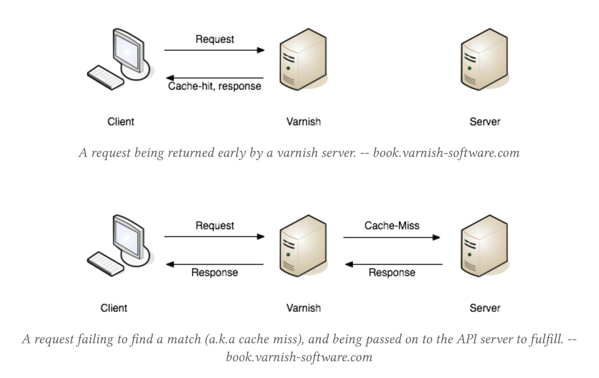

## HTTP Caching

### Stop Melting The Ice Caps

PHP South West

<small>@philsturgeon</small>

---

Who leads? Client or Server?

---

Caching is for the client (consumer)

---

JSON-API/GraphQL optimize for _network speed_

Note: Each interaction must be the quickest possible

---

<!-- .slide: data-background="img/shrink-graphql.png" data-background-size="contain" data-background-color="#fff" -->

---

REST optimizes for _network efficiency_ over _network speed_

---

_Trimming_ a resource is usually not as useful as _reusing_ a resource

---

Why are you doing pointless stuff quickly?

---

Just... stop doing pointless stuff!!

---

<!-- .slide: data-background="img/rest-disert.png" data-background-size="contain" data-background-color="#fff" -->

---

<!-- .slide: data-background="img/cache-rest.png" data-background-size="contain" data-background-color="#fff" -->

---

<!-- .slide: data-background="img/richardson-cache.png" data-background-size="contain" data-background-color="#fff" -->

---

> "Um, like, REST didn't invent caching, we already cache our applications with Redis!" says **Imaginary Narrative Device**

---

Wrong type of caching there bud.

---

Even if your application/API/server/service responds in 1ms, network latency is ~100ms

---

<!-- .slide: data-background="img/pucklechurch-latency.png" data-background-size="contain" data-background-color="#fff" -->

---

> **IND:** Oh, you're talking about caching responses, which we also do with Redis?

---

## This Junk

``` ruby
Rails.cache.fetch("users/#{uuid}", expires_in: 12.hours.from_now) do
  UserAPI.find_user(uuid)
end
```

---

Something that GraphQL actually _recommends_

---

<!-- .slide: data-background="img/lol-graphql-caching.png" data-background-size="contain" data-background-color="#fff" -->

---

<!-- .slide: data-background="img/wtf-no-graphql-caching.png" data-background-size="contain" data-background-color="#fff" -->


---

<!-- .slide: data-background="img/graphql-caching-from-uuids.jpg" data-background-size="cover" data-background-color="#000" -->

---

GraphQL and endpoint-APIs which fail to offer cacheability all force "naive client caching"

---

## Expiry Guessing
### Problem 1

12 hours is an **arbitrary number** plucked out my...

brain 🤔

Note: Why is the client setting rules for data owned by the server?

---

## Expiry Changing
### Problem 2

12 might be a good idea now, but could become incorrect over time

Note: origin server decreases retention to 3 hours + improves performance to get closer to real time
You have old data, other clients have new data!

---

## Invalidations
### Problem 3

Client must subscribe to AMQP, WebSockets, etc. to invalidate

---

REST says these problems should be a concern of the **server**

---

"Endpoint-based APIs" can utilize all of [RFC 7234](https://tools.ietf.org/html/rfc7234)

- `Expires`
- `Cache-Control`
- `ETag`
- `If-Modified-Since`
- `Varies`
- _and more!_

---

## <strike>Expiry Guessing</strike>

```
Cache-Control: public, max-age=28800
```

---

## <strike>Expiry Changing</strike>

```
Cache-Control: public, max-age=25200
```

---

REST **does not force caching**, but you should **declare cacheability**

---

## Uncacheable Response

```
Cache-Control: no-cache, no-store, must-revalidate
```

---

## <strike>Invalidations</strike>

```
Cache-Control: public, max-age=25200
ETag: some-opaque-string-abc
```

...

```
GET /turtles/123
If-Match: some-opaque-string-abc
```

↓

```
HTTP/1.1 304 Not Modified
```

---

Not Modified means "Use the response you already have"

---

Server doesn't need to serialize JSON

---

``` ruby
class TurtlesController < BaseController
  def show
    turtle = ...

    expires_in(15.minutes, public: true)
    if stale?(turtle)
      render json: serialize(turtle)
    end
  end
end
```

---

Client doesn't have to wait for that JSON to download

---

<!-- .slide: data-background="img/content-download.png" data-background-size="contain" data-background-color="#fff" -->

---

Clients can completely ignore expiry headers if they want to

---

<!-- .slide: data-background="img/ignore-expiry-headers-if-you-want.jpg" data-background-size="contain" data-background-color="#fff" -->

---

### Common response cache strategy

- Before going to network, check for fresh content in cache

- If stale content is found, a conditional request will be created

- If no content, a normal request is created

---


> **INB:** This sounds like hard work

---

Writing all the code is hard, so don't do it

---

Any RFC 7234 compatible middleware/implementation is fine

---

## Ruby/Rails

```
client = Faraday.new do |builder|
  builder.use :http_cache, store: Rails.cache
  ...
end
```

[faraday-http-cache](https://github.com/plataformatec/faraday-http-cache)

---

## PHP

```
use GuzzleHttp\Client;
use GuzzleHttp\HandlerStack;
use Kevinrob\GuzzleCache\CacheMiddleware;

$stack = HandlerStack::create();
$stack->push(new CacheMiddleware(), 'cache');
$client = new Client(['handler' => $stack]);
```

[guzzle-cache-middleware](https://github.com/Kevinrob/guzzle-cache-middleware)

---

> **IND:** Agh that's scary, it's going to add caching to all requests that use that HTTP client?!?!?1

---

<!-- .slide: data-background="img/thats-great.gif" data-background-size="contain" data-background-color="#000" -->

---

> **IND:** I don't like the idea of the server taking away my freedoms. I want control over using cached data or not!

Note: Just edited something, want to 100% absolutely use newest thing?

---

## Easy Enough

```
GET /turtles/123
Cache-Control: no-cache
```

<small>More on [developer.mozilla.org](https://developer.mozilla.org/en-US/docs/Web/HTTP/Headers/Cache-Control)</small>

---

> no-cache doesn't mean "don't cache", it means it must check (or "revalidate" as it calls it) with the server before using the cached resource. no-store tells the browser not to cache it at all.

**Source:** [jakearchibald.com](https://jakearchibald.com/2016/caching-best-practices/)

😅

---

> Also must-revalidate doesn't mean "must revalidate", it means the local resource can be used if it's younger than the provided max-age, otherwise it must revalidate. Yeah. I know.

**Source:** [jakearchibald.com](https://jakearchibald.com/2016/caching-best-practices/)

🤣

---

<!-- .slide: data-background="img/local-cache.png" data-background-size="contain" -->

---

<!-- .slide: data-background="img/network-cache.png" data-background-size="contain" -->

---

## Network Caching

HTTP has loads of amazing caching proxies:

- Vanish
- Squid
- Fastly
- Nginx!

---



---

### Customization vs Caching

`GET /turtles/123?fields=name,lifespan`

---

`/turtles/123`

≠

`/turtles/123?fields=name,lifespan`

≠

`/turtles/123?fields=name,lifespan,weight`

≠

`/turtles/123?fields=name,weight,lifespan`

---

Why even bother?!

---

A scenario where Clients A and B both care about trimming their response, on a network cached API

---

**Client A**

`GET /turtles?fields=name,lifespan`

200ms

---

**Client B**

`GET /turtles?fields=name`

192ms

---

Yay 4% speedup by missing the cache to skip one field

---

**Client A**

`GET /turtles`

220ms

---

**Client B**

`GET /turtles`

118ms

---

10% slow down requesting all the things

_buuuut_

46% speedup by hitting that shared cache

---

Client A and Client B then both add client caches 👍🏼

---

🎊 118ms becomes 4ms as they hit a local memcache on internal DNS 🎊

---

## Compromise

Use [partials](https://blog.apisyouwonthate.com/a-happy-compromise-between-customization-and-cacheability-e48dc083ed10) as a middleground

```
GET /turtles?partial=dimensions
```

<small>is.gd/api_partials</small>

---

That said if you're using partials/fields, you probably just want smaller resources and make more HTTP/2 requests, but...

---


<small><a href="http://leanpub.com/talking-to-other-peoples-web-apis/c/BRIZZLE">leanpub.com/talking-to-other-peoples-web-apis/c/BRIZZLE</a></small>

---

<!-- .slide: data-background="img/ice-caps.jpg" data-background-size="contain" -->

---

[joind.in/talk/ae67c](http://joind.in/talk/ae67c)

---
