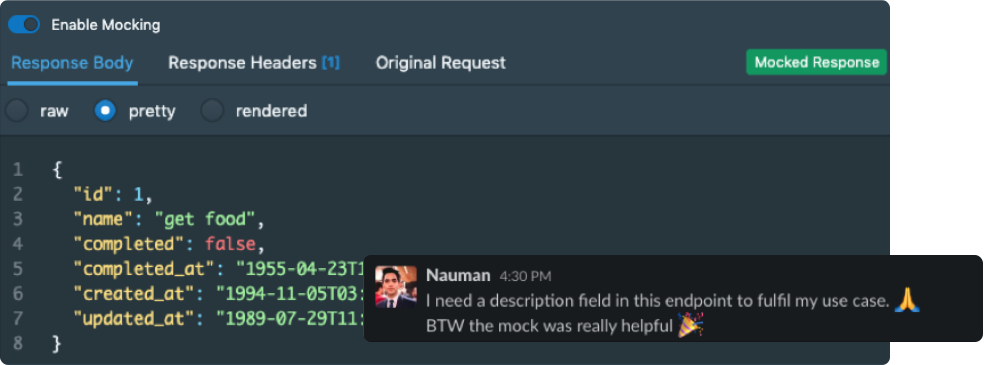
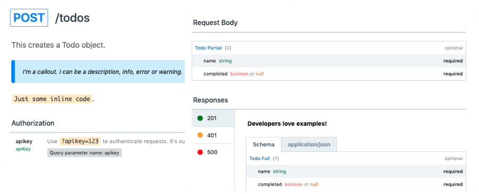
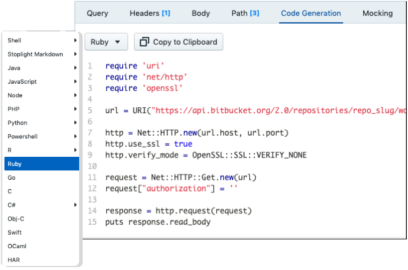

<!-- .slide: data-background="img/bg.jpeg" -->

<br>
<br>
<br>
<span style="font-size: 60pt; color: black">API Design First<br>and Evolve</span>

---

<!-- .slide: data-background="img/intro.png" data-background-color="#eee" -->

---

<!-- .slide: data-background="img/wework.jpg" -->


---

<!-- .slide: data-background="img/lifecycle.png" data-background-size="contain" data-background-color="#eee" -->

---

<!-- .slide: data-background="img/lifecycle1.png" data-background-size="contain" data-background-color="#eee" -->

---

<!-- .slide: data-background="img/lifecycle2.png" data-background-size="contain" data-background-color="#eee" -->

---

<!-- .slide: data-background="img/lifecycle3.png" data-background-size="contain" data-background-color="#eee" -->

---

## API Workflow Questions

1. Swagger, OpenAPI v3, API Blueprint, RAML? 
2. Annotations or YAML? <!-- .element: class="fragment" -->
3. Design First or Code First? <!-- .element: class="fragment" -->
4. Where are the visual editors? <!-- .element: class="fragment" -->
5. How/when do we create documentation? <!-- .element: class="fragment" -->
6. How/when do we create mocks?  <!-- .element: class="fragment" -->
7. How do we keep code and docs in sync?  <!-- .element: class="fragment" -->

---

## The API Description Format <!-- .element: style="color: black" -->


<!-- .slide: data-background-color="#fff" -->


---

OpenAPI is an API Description Format for creating HTTP API Descriptions.

---

You can describe your API with a Description Document.

e.g.: `openapi.yaml`

---

```yaml
openapi: 3.0.3

info:
  version: v1.0
  title: RemoteOk Jobs API
  contact:
    email: support@remoteok.io
  description: >
    Remotely interested in an a job? This is a JSON feed from RemoteOk.io with
    all the latest jobs. You can't search by category or tag as far as we can
    tell, but... you can sift through!

servers:
  - url: 'https://remoteok.io/api'
    description: Production
  - url: 'https://sandbox.remoteok.io/api'
    description: Sandbox

paths:
  /:
    get:
      operationId: get-listings
      summary: All Listings
      responses:
        '200':
          description: OK
          content:
            application/json:
              schema:
                $ref: '#/components/schemas/Listings'

components:
  schemas:
    Listings:
      type: array
      items:
        $ref: '#/components/schemas/Listing'
    Listing:
      type: object
      additionalProperties: false
      properties:
        slug:
          type: string
        id:
          type: string
          format: integer
        epoch:
          type: string
          format: integer
        date:
          type: string
          format: date-time
        company:
          type: string
        company_logo:
          type: string
        position:
          type: string
        tags:
          type: array
          items:
            type: string
        description:
          type: string
        url:
          type: string
          format: uri
        logo:
          type: string
          format: uri
        original:
          type: boolean
        verified:
          type: boolean
      required: 
      - slug
      - id
      - epoch
      - date
      - company
      - company_logo
      - position
      - tags
      - description
      - url
```

---

```yaml
type: object
properties:
  name:
    title: Name
    type: string
    description: Users full name supporting unicode but no emojis.
    maxLength: 20
  email:
    title: Email
    description: Like a postal address but for computers.
    type: string
    format: email
  date_of_birth:
    title: Date Of Birth
    type: string
    description: 'Date of users birth in the one and only date standard: ISO 8601.'
    format: date
    example: 1990–12–28
required:
- name
```

---

<!-- .slide: data-background="img/oas-members.png" data-background-size="contain" data-background-color="#f6f6f6" -->

---

## Annotations or YAML?

---

```java
class UserController {
  @OpenApi(
      path = "/users",
      method = HttpMethod.POST,
      // ...
  )
  public static void createUser(Context ctx) {
      // ...
  }
}
```

---

```php
/**
  * @OA\Get(path="/2.0/users/{username}",
  *   operationId="getUserByName",
  *   @OA\Parameter(name="username",
  *     in="path",
  *     required=true,
  *     description=Explaining all about the username parameter
  *     @OA\Schema(type="string")
  *   ),
  *   @OA\Response(response="200",
  *     description="The User",
  *     @OA\JsonContent(ref="#/components/schemas/user"),
  *     @OA\Link(link="userRepositories", ref="#/components/links/UserRepositories")
  *   )
  * )
  */
public function getUserByName($username, $newparam)
{
}
```

---

```js
/**
 * @swagger
 * /users:
 *   get:
 *     description: Returns users
 *     produces:
 *      - application/json
 *     responses:
 *       200:
 *         description: users
 *         schema:
 *           type: array
 *           items:
 *             $ref: '#/definitions/User'
 */
app.get('/users', (req, res) => {
});
```

---

> Code comments are just facts waiting to become lies.

_<small>Vinai Kopp, A talk at #MM18IT</small>_

---

<!-- .slide: data-background="img/code-comments.jpg" data-background-size="contain" data-background-color="#121212" -->

---

## Code First vs Design First

---

<!-- .slide: data-background="img/poll.png" data-background-size="contain" data-background-color="#fff" -->


---

<!-- .slide: data-background="img/wf-1.png" data-background-size="contain" data-background-color="#eee" -->

---

<!-- .slide: data-background="img/wf-2.png" data-background-size="contain" data-background-color="#eee" -->

---

<!-- .slide: data-background="img/blueprint.jpeg" -->

---

Most API planning is not machine readable. Especially napkins napkins.

---

<!-- .slide: data-background="img/wf-3.png" data-background-size="contain" data-background-color="#eee" -->

---

<!-- .slide: data-background="img/wf-4.png" data-background-size="contain" data-background-color="#eee" -->

---

<!-- .slide: data-background="img/workflow.jpeg" data-background-size="contain" data-background-color="#fff" -->

---

<!-- .slide: data-background="img/workflow2.jpeg" data-background-size="contain" data-background-color="#fff" -->

---

> While OpenAPI is great for describing APIs, ... **it's definitely not a great experience to write OpenAPI documents from scratch**.

_<small>Sebastien Armand, "Making OpenAPI Bearable With Your Own DSL"</small>_

---

```
;;; ENTITIES
(define pet-entity
 (entity "Pet"
    'race (string "What kind of dog / cat this is (labrador, golden retriever, siamese, etc...)" "Labrador")
    'origin (string "Country of origin" "Egypt")
    'birthday (datetime "Birth date of the pet" "2017-10-20T00:14:02+0000")
    'species (string "What kind of animal is this" "dog" #:enum '("dog" "cat"))))
(define $pet (schema-reference 'Pet pet-entity))

;;; RESPONSES
(define list-pets-response (jsonapi-paginated-response "List of pets" ($pet)))
 
;;; REQUESTS
(define pet-request (json-request "Pet Request Body" ($pet)))
 
;;; MAIN DOC
(define swagger
 (my-service-api-doc "Pet Store" "Per store pets management"
   (path "/pets") (endpoint-group
      'tags pet-tags
      'parameters (list store-id-param)
      'get (endpoint
              'operationId "listPets"
              'summary "Retrieve all the pets for this store"
              'parameters pagination-params
              'responses (with-standard-get-responses 200 list-pets-response))
      'post (endpoint
              'operationId "createPet"
              'summary "Create a new Pet record"
              'requestBody pet-request
              'parameters (list xsrf-token)
              'responses (with-standard-post-responses 200 single-pet-response)))
```

---

**Where are the visual editors?**

---

openapi.tools/#gui-editors

---

<!-- .slide: data-background="img/stoplight.png" data-background-size="contain" data-background-color="#fff" -->

---

<!-- .slide: data-background="img/stoplight-workflow.jpeg" data-background-size="contain" data-background-color="#fff" -->

---

<!-- .slide: data-background="img/studio-editor.png" data-background-size="contain" data-background-color="#000" -->

---

<!-- .slide: data-background="img/git.png" data-background-size="contain" data-background-color="#f5f7f9" -->

---

<!-- .slide: data-background="img/studio-files.png" data-background-size="contain" data-background-color="#eee" -->

---

<!-- .slide: data-background="img/studio-adv.png" data-background-size="contain" data-background-color="#000" -->

---

<!-- .slide: data-background="img/studio-spectral.png" data-background-size="contain" data-background-color="#f5f7f9" -->

---

<!-- .slide: data-background="img/styleguides.svg" data-background-size="contain" data-background-color="#f5f7f9" -->

---

## API Description Linting

a.k.a "API Style Guides"

---

<!-- .slide: data-background="img/workflow-lint.jpeg" data-background-size="contain" data-background-color="#000" -->

---

<!-- .slide: data-background="img/lint-cli-vscode.jpg" data-background-size="contain" data-background-color="#000" -->

---

<!-- .slide: data-background="img/lint-errors.jpg" data-background-size="contain" data-background-color="#000" -->

---

**How/when do we create mocks?**

1. Local Mock Servers
2. Hosted Mock Servers 

http://openapi.tools/#mock

---

**Local Mock Server**


---

**Hosted Mock Server**

`https://acme.stoplight.io/mocks/widgets`



---

**How/when do we create documentation?**

1. CI deploys HTML to S3
2. Read from Git repo on push

---

Automatic generated API Reference docs



---

Automatic generated Code Samples



---

⛔️ **How do we keep code and API docs in sync?**

---

<!-- .slide: data-background="img/docs-api.jpg" data-background-size="contain" data-background-color="#fff" -->

---

✅ **How to re-use API descriptions as code!**

---

## Server-side Validation

- Model?
- Controller? <!-- .element: class="fragment" -->
- View? 😱 <!-- .element: class="fragment" -->
- Service? <!-- .element: class="fragment" -->
- Contract? <!-- .element: class="fragment" -->

---

## Server-side Ruby Validation

``` ruby
class NewUserContract < Dry::Validation::Contract
  params do
    required(:email).filled(:string)
    required(:age).value(:integer)
  end

  rule(:email) do
    unless /\A[\w+\-.]+@[a-z\d\-]+(\.[a-z\d\-]+)*\.[a-z]+\z/i.match?(value)
      key.failure('has invalid format')
    end
  end

  rule(:age) do
    key.failure('must be greater than 18') if value < 18
  end
end
```

---

## Server-side JavaScript Validation

```js
import Joi from 'joi';

export default {
  createUser: {
    body: {
      username: Joi.string().regex(/^[0-9a-fA-F]{24}$/).required(),
      email: Joi.string().required(),
      age: Joi.number()
    }
  }
};
```

Note: Most JS examples are so gross they dont fit on screen

---

## Looks like an API Description

``` yaml
type: object
properties:
  username: 
    type: string
  email: 
    type: string
    format: email
  age: 
    type: integer
    minimum: 18
required:
- email
- age
```

---

Multiple Sources Of Truth = Checking For LIES

---

Dredd, takes a lot of work and breaks so much teams just turn it off

https://dredd.org/

---

## Reuse API Descriptions for Validation

---

<!-- .slide: data-background="img/docs-api-reuse.jpg" data-background-size="contain" data-background-color="#fff" -->

---

OpenAPI Validation Middlewares can reject invalid requests with "no code".

---

```ruby
# config/application.rb

config.middleware.use Committee::Middleware::RequestValidation,
  schema_path: 'openapi.yaml'
```

---

```php
use League\OpenAPIValidation\PSR15\ValidationMiddlewareBuilder;
use League\OpenAPIValidation\PSR15\SlimAdapter;

$psr15Middleware = (new ValidationMiddlewareBuilder)
  ->fromYamlFile('openapi.yaml')
  ->getValidationMiddleware();

/** @var \Slim\App $app */
$app->add(new SlimAdapter($slimMiddleware));
```

---

```js
{
  "errors": [
    {
      "status": "422",
      "detail": "The property '#/widget/price' of type string did not match the following type: integer",
      "source": {
        "pointer": "#/widget/price"
      }
    }
  ]
}
```

---

- **Ruby:** [committee](https://github.com/interagent/committee)
- **PHP:** [league/openapi-psr7-validator](https://github.com/thephpleague/openapi-psr7-validator)
- **NodeJS:** [fastify](https://github.com/fastify/fastify/blob/master/docs/Validation-and-Serialization.md) or [express-ajv-swagger-validation](https://github.com/Zooz/express-ajv-swagger-validation)
- **Java/Kotlin:** [openapi-spring-webflux-validator](https://github.com/cdimascio/openapi-spring-webflux-validator)
- **Python:** [connexion](https://github.com/zalando/connexion)
- **Mojolicious:** [Mojolicious](https://metacpan.org/pod/Mojolicious::Plugin::OpenAPI)

---

If you have validation code, you can delete it.

If this is a new application, you **don't need to write it**.

---

"Data-store Validations" like "is email unique" still need to happen 👍

---

Your integration/e2e test suite proves the **requests** work as expected.

Documented requests are now _proven_ to be correct.

---

What about responses?

---

Middlewares _can_ validate responses, but why waste time in prod?

---

Your test suite can contract test **responses** with OpenAPI.

---

```yaml
  responses:
    "200":
      description: OK
      content:
        application/json:
          schema:
            $ref: ./models/user.json
```

---

```rb
JsonMatchers.schema_root = "api/models/"

it 'should conform to user schema' do
  get "/users/#{subject.id}"
  expect(response).to match_json_schema('user')
end
```

<small>https://apisyouwonthate.com/blog/writing-documentation-via-contract-testing</small>

---

<!-- .slide: data-background="img/single-source.jpg" data-background-size="contain" data-background-color="#fff" -->

---

<!-- .slide: data-background="img/wf-4.png" data-background-size="contain" data-background-color="#eee" -->

---

<!-- .slide: data-background="img/questions.jpg" style="text-align: left" -->

# Thank You! 

[ApisYouWontHate.com](https://apisyouwonthate.com) <!-- .element: style="font-size: 38pt; color: #eee" -->

[Stoplight.io](https://stoplight.io) <!-- .element: style="font-size: 38pt; color: #eee" -->

@philsturgeon
