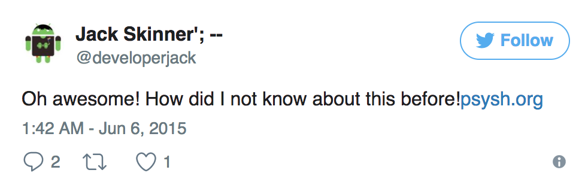
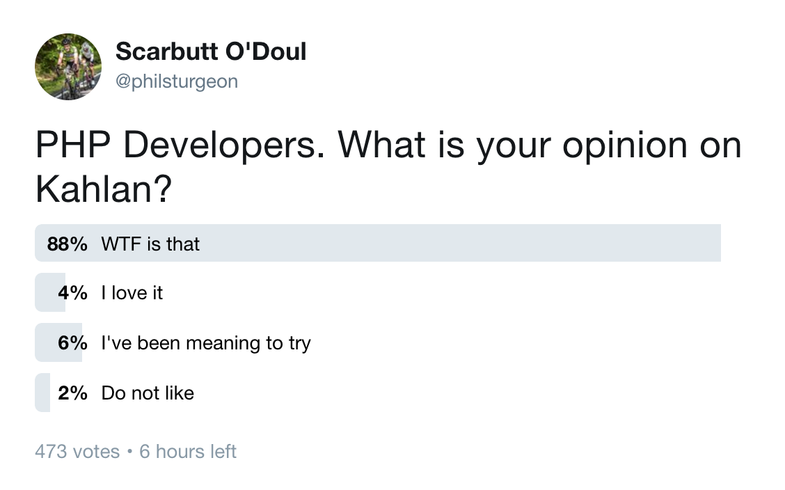

# What <s>Rails</s> Ruby Can Teach PHP About Building APIs

### PHPNE 2017 / @philsturgeon

---

<!-- .slide: data-background="img/surgery.jpg" data-background-size="contain" -->

---

I built APIs with PHP 2009 - 2014

---

Switched to Rails for a job in 2014

---

<!-- .slide: data-background="img/intro-happy.jpg" -->

---

<!-- .slide: data-background="img/intro-sad.jpg" -->

---

<!-- .slide: data-background="img/intro-wtf.jpg" data-background-size="contain" -->

---

## Agenda

1. 📜

1. 😍

1. 😦

---

## 📜

---

## Gems released 2004

---

## PEAR released 1999

---

## ̴1 million frameworks 2005-2012

---

## Composer released 2009

---

## Framework Package Managers

- CodeIgniter Sparks

- Laravel Bundles

- CakePHP Bakery

- Fuel Cells

- Zend Modules

Note: Ignoring Composer, frameworks build own package managers

---

## PHP Had Frameworks FOR DAYS

CakePHP / CodeIgniter / Fat-Free / FuelPHP (😅)
Kohana / Laravel / Lithium / Silex / Symfony / Yii / Zend

Note: No similarities between frameworks, nothing worked in more than one

fuel-oauth2-client, codeigniter-oauth2-client, laravel-oauth2-client, etc

---

## Ruby had a few frameworks

Sinatra / Rails / Merb*

Note: merb merged in 2008

focus was less split than PHP

---

## Ruby gems are mostly agnostic

No sinatra-oauth2-client

No rails-oauth2-client

Just oauth2-client

---

# PSR-0 released 2010

Note: Generally ignored by most, me too

---

## PHP-FIG made agnostic composer packages viable ̴2012

---

### Ruby has spent 8 more years building packages

2004 vs 2012

---

## Ruby didn't need a Ruby-FIG

### Willingness and ability to cooperate

Note: Opposite of the FIG, bridge gap very different projects to converge

Fewer silos to split work in first place

willingness to work together early on, less petty


---

### Gems can change ownership easily

`gem "oauth2-client"`

Note: Creator isn't important, authors arent held hostage

---

### Composer vendors create "brand oppertunity"

## Many devs want vendorname/fame

Note: 5min fast / 10min slow

That can be seen League reaction

Other ways to do it
help people / prs / issues
blog

async

---

### The PHP League learned a lot from Ruby

A critical mass of users creates a defacto standard

Note: Abandoned alts redirected to us

---

### The PHP League learned a lot from Ruby

The (current) author is not as important as the package

---

### The PHP League learned a lot from Ruby

Tying code to a framework is a waste of everyones time

---

### The PHP League literally ported code from Ruby

🤷‍♂️

---

## What about these amazing API, HTTP & Testing tools?!

---

## 😍

Note: TEN IS FAST SLOW THE FUCK DOWN

---

`rails new --api your-project`

### No cookies / sessions / browser stuff

---

### Rack HTTP middleware helps building APIs

Rack::Attack / Rack::ConditionalGet / Rack::ETag / Rack::Cache / Rack::Proxy / Rack::Referrals / Rack::Throttle / Rack::Turnout

Note: Many middlewares really help building APIs

---

## HTTP Client Middleware

Request: auth, refresh tokens, format body, error if missing user agent

---

## HTTP Client Middleware

Response: autoconvert JSON/XML, turn status codes into exceptions, etc

---

### Combining Client + Server Middleware

```
+Deprecate.new(date: '2017-07-13 15:42:12 GMT')
def create
  # ...
end
```

---

### Combining Client + Server Middleware

Server Middleware injects HTTP Header

`Sunset: Thu, 13 Jul 2017 15:42:12 GMT`

---

### Combining Client + Server Middleware

HTTP Client Middleware freaks out on the CLI!

`Endpoint Deprecated: Will cease to function in 26 days!`

---

Rails implements a lot of functionality as Rack Middleware

---

### Rails handles conditional GET

## ETag and Last-Modified

---

```
def show
  @article = Article.find(params[:id])

  if stale?(etag: @article, last_modified: @article.updated_at)
    @statistics = @article.really_expensive_call
    respond_to do |format|
      # all the supported formats
    end
  end
end
```

---

### Without E-Tag

```text
Completed 200 OK in 35ms (Views: 33.4ms | ActiveRecord: 0.3ms)
```

---

### With E-Tag

```text
Completed 304 Not Modified in 2ms (ActiveRecord: 0.3ms)
```

---

`35ms vs 2ms = 94% improvement!`

---

_[Read more on ETags](https://robots.thoughtbot.com/introduction-to-conditional-http-caching-with-rails)_

---

Rails: HEAD Requests

Note: Rails will transparently convert HEAD requests into GET ones, and return just the headers on the way out

---

### Rack = PSR-7 + PSR-15 (Draft)

PSR-7 is just the message

(RelayPHP / EquipPHP / etc.)

---

### Rack = PSR-7 + PSR-15 (Draft)

PSR-15 standardises passing middlewares around

---

[Read more on HTTP middleware in PHP](https://philsturgeon.uk/php/2016/05/31/why-care-about-php-middleware/)

---

## describe-it testing

<video>
  <source data-src="video/kahlan.mp4" type="video/mp4" autoplay />
</video>

---

```php
describe('GET /foo/{id}', function() {
  context('when a valid token is provided', function() {
    context('and foo exists', function() {      
      context('and foo is active', function() {
        it('do some test', function() {
          // test that foo is returned
        });
      });
      context('and foo is archived', function(){
        // test that response is gone (410)
      })
    });
    context('and foo does not exist', function() {
      // test that foo is not found (404)
    })
  });
});
```

---

## describe-it testing

BDD but not plain text

Note: Can't write a rule for everything
unit / integration / everything can be spec

---

### describe-it testing

## Ruby

- [rspec](http://rspec.info)
- [minitest-spec](https://github.com/seattlerb/minitest)

---

### describe-it testing

## PHP

- [Kahlan](https://kahlan.github.io/docs/)
- [Codeception/Specify](https://github.com/Codeception/Specify)

---

### Integration Tests

## Real Fake Interactions

Note: don't want dev server

You'd need to spin it up and down hundreds/thousands of times

---


Note: Just unit testing controllers is not realistic

similate real req/resp

---

### Integration tests

## Intercept Outgoing HTTP Calls

Note: Block any HTTP calls made from your tests

---

## Allow "Record Mode"

### Replay from recordings later

---

<!-- .slide: data-background="img/phpvcr-overview.png" data-background-size="contain" -->

---


---

### Testing requests doesn't go over "wire"

## Ruby

- [ActionDispatch](http://dylanninin.com/blog/2013/11/26/rails4_ad_ac.html) (Rails)
- [Rack::Test](https://github.com/rack-test/rack-test) (Rack)

---

## Data factories

---

### Data factories

``` ruby
FactoryGirl.define do
  factory :user do
    first_name "John"
    last_name  "Doe"
    admin false
  end

  factory :admin, class: User do
    first_name "Admin"
    last_name  "User"
    admin      true
  end
end
```

---

### Data factories

``` ruby
# Returns a User instance that's not saved
user = build(:user)

# Returns a saved User instance
user = create(:user, first_name: "Gary")
```

---

### Data factories

## Combined with describe-it contexts these are very useful

---

### Data factories

## Ruby

[FactoryGirl](https://github.com/thoughtbot/factory_girl)

---

### Data factories

## PHP

[Factory Muffin](http://factory-muffin.thephpleague.com/)

---

## Simple State machines

```ruby
class InvoiceStateMachine
  include Statesman::Machine

  state :draft, initial: true
  state :published
  state :sent
  state :paid

  transition from: :draft,        to: :published
  transition from: :published,    to: [:draft, :sent, :paid]
  transition from: :sent,         to: :paid

  # next slide
end
```

---

## Simple State machines

```ruby
  guard_transition(to: :sent) do |invoice|
    invoice.has_contact_info?
  end

  before_transition(to: :sent) do |invoice, transition|
    EmailService.new(invoice).send_contact_invoice
    invoice.touch(:sent_at)
  end

  after_transition(to: :paid) do |invoice, transition|
    EmailService.new(invoice).send_owner_success
    invoice.touch(:paid_at)
  end
```

---

## Simple State machines

``` ruby
invoice.current_state # => "draft"
invoice.allowed_transitions # => ["pay"]
invoice.can_transition_to?(:sent) # => true/false
invoice.transition_to(:paid) # => true/false
```

---

## This is how you make HATEOAS!

```
{
  "data": {
    "type": "invoice",
    "id": "093b941d",
    "attributes": {
      "bla": "stuff",
      "status": "draft"
    }
  },
  "links": {
    "pay": "https://api.acme.com/invoices/093b941d/payment_attempts"
  }
}
```

---

### Simple State Machines

## Ruby

- [aasm](https://github.com/aasm/aasm)
- [statesman](https://github.com/gocardless/statesman)
- [state_machine](https://github.com/pluginaweek/state_machine)

---

### Simple State Machines

## PHP

- ????
- [State](https://github.com/sebastianbergmann/state) by Sebastian Bergmann

---

## Serialization

### Like views for your data!

---

```ruby
class SongRepresenter < Roar::Decorator
  include Roar::JSON

  property :title
  property :lyrics
end
```

```ruby
SongRepresenter.new(song).to_json
#=> {"title":"Medicine Balls"}
```

---

Serialization is one of [the most important](https://philsturgeon.uk/api/2015/05/30/serializing-api-output/) aspects of your API

---

### Serialization

## Ruby

- [ActiveModel Serializers](http://api.rubyonrails.org/classes/ActiveModel/Serialization.html) 💩 (Semi Official Rails)
- [OAT](https://github.com/ismasan/oat) 🎖
- [ROAR](https://github.com/trailblazer/roar) 🎖

---

### Serialization

## ROAR also offers **_deserialization_**

---

### Serialization

```ruby
song = Song.new(title: "Medicine Balls")

SongRepresenter.new(song).from_json('{"title":"Linoleum"}')
song.title #=> Linoleum
```

---

## Serialization

### PHP

- [Fractal 💩](https://github.com/vlucas/hyperspan)
- [Hyperspan 🎖](https://github.com/vlucas/hyperspan)

---

## Inline REPL debugging

---

<iframe width="924" height="520" src="https://www.youtube.com/embed/_BKeAOJTQq8" frameborder="0" allowfullscreen></iframe>

[by Steve Goodstein](https://youtu.be/_BKeAOJTQq8)

Note: Works regardless of Editor/IDE

Docker support with zero changes

---

### Inline REPL debugging

## Ruby

- [byebug](https://github.com/deivid-rodriguez/byebug)
- [pry](https://github.com/pry/pry)

---

### Inline REPL debugging

## PHP

- [PsySH](http://psysh.org/)

---



---

## Moneypatching 🙈

---

### Moneypatching 🙈

### Good for testing, bad for everything else

---

### Kahlan has monkey patching for testing!

---

```php
it("shows some examples of function stubbing", function() {

  allow('RabbitMQ')->toReceive('publish')
    ->with('a very important message')
    ->andReturn(true);

  $subject->doImportantThing();
}
```

---



---

Use [Kahlan](https://kahlan.github.io/docs/) more!!

---

## 😦

---

## Rails has no respect

```
{
  "action" : "foo"
}
```

```
def create
  params[:action] # create 😭
end
```

---

### Form data, JSON param, query string...

# Rails munges it ALL

---

## Rails thinks REST = CRUD over HTTP

Note: Nothing about hypermedia anywhere

create edit delete thats it

---

## Rails thinks PUT === PATCH

[_They are very different_](https://philsturgeon.uk/api/2016/05/03/put-vs-patch-vs-json-patch/)

---

[Too much routing magic](https://philsturgeon.uk/php/2013/07/23/beware-the-route-to-evil/)

---

## Rails has some weird defaults


---

Sometimes you gotta override core methods

```

def request_http_token_authentication(realm = "Application")

  authenticate = %(Token realm="#{realm.gsub(/"/, "")}")

  self.headers["WWW-Authenticate"] = authenticate

  render json: { error: "HTTP Token: Access denied." },
    status: :unauthorized

end

```

---

### Rails controller tests are pointless garbage

Use requests tests

---

And Other Minor Gripes


---

## Rails is ok

---

# Ruby is great

---

Their focus on collaboration instead of jostling for greatness is _awesome_

---

### Play with some gems when you get home

---

### Play with _other_ languages when you get home

---

### Take inspiration from these experiences

---

## Better the PHP ecosystem

---

# Cheers!

joind.in/talk/ba5fd

@philsturgeon
